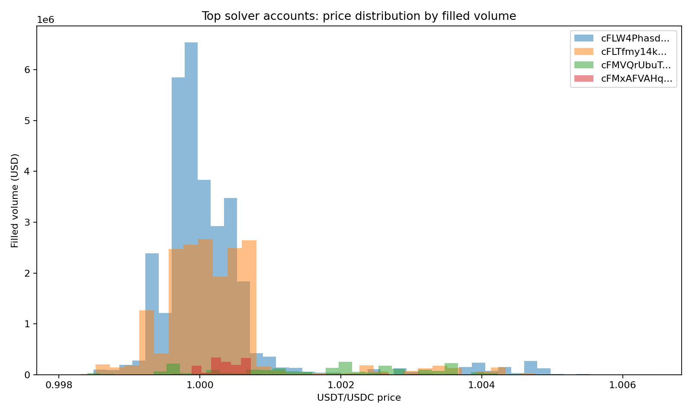
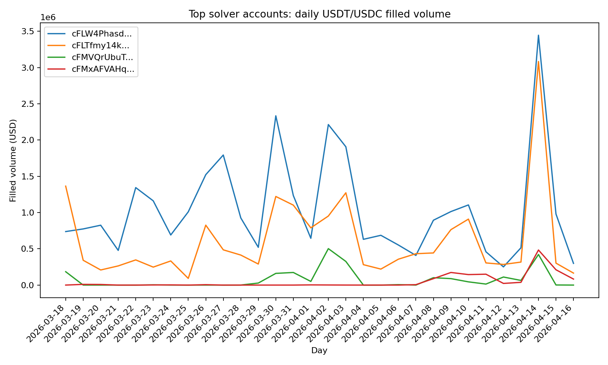
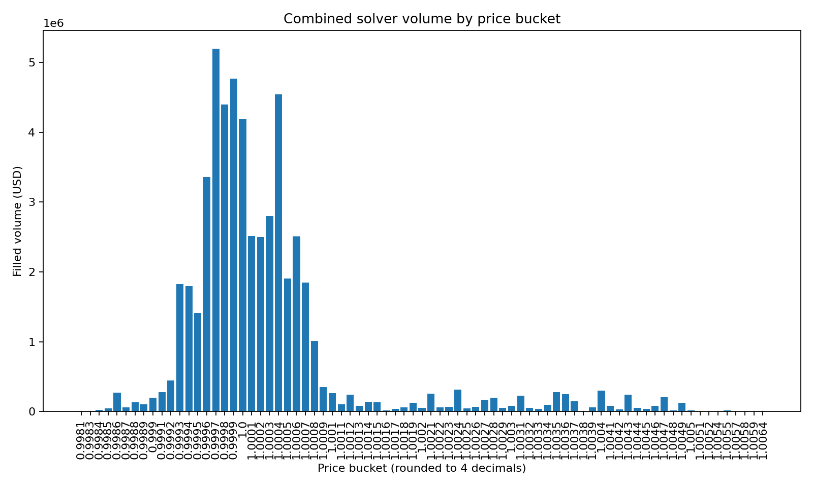

# Chainflip USDT/USDC LP Analysis Summary

Status: Reference / Historical Analysis
Scope: Based on 90-day dataset (pre S1–S3)
Do not use as decision source without validation against current data

## Executive summary

The pool is **solver-dominated**, not passive-LP dominated. The core overlap zone is near **0.9997-1.0003**, where the top solver cluster is thickest. The most promising opportunity for your ladder is **slightly below that centerline**, where volume remains meaningful but overlap weakens.

Main takeaways:
- The dominant accounts are mostly **invisible LIMIT-based liquidity**, not visible range LPs.
- The top solver cluster overlaps heavily: **80.0%** of their combined USDT/USDC volume traded at exact price levels used by **all 4** main solver accounts.
- Your best opportunity is **not** far outside the solver band. It is **inside flow but off the solver centerline**, especially on the lower side.
- Scaling size alone is unlikely to help much unless depletion becomes a bigger issue. Positioning matters more than raw size.

## Solver and LP account table (USDT/USDC only)

| Wallet                                            |   USDT/USDC fills | Volume (USD)   |   Days active | Avg fill (USD)   | Min price   | Max price   | Sell USDT bias   |   Unique prices |
|:--------------------------------------------------|------------------:|:---------------|--------------:|:-----------------|:------------|:------------|:-----------------|----------------:|
| cFLW4PhasdivcJKuA2BGw9Y9dz7EFwks82K8Z6U3MfCk8WcNW |              7074 | $31,364,756.10 |            30 | $4,433.81        | 0.998302    | 1.005716    | 41.3%            |              67 |
| cFLTfmy14kAMbKgFjGNKeJ9P9NqmcoveQ1WdgsqRq3RxUu9Wu |              4883 | $18,424,006.26 |            30 | $3,773.09        | 0.998102    | 1.006420    | 54.4%            |              67 |
| cFMVQrUbuTuXmeRinPQovRkCgoyrrRd3N4Q5ZdHfqv4VJi5Hh |               250 | $2,285,123.75  |            20 | $9,140.50        | 0.998401    | 1.005917    | 97.6%            |              59 |
| cFMxAFVAHqLTcnJaiaUC7LpNA14fJdu1bi7xeGsafBgW24EXW |              1055 | $1,434,352.27  |            20 | $1,359.58        | 0.999600    | 1.005213    | 49.1%            |              25 |
| cFKGruFT87gLRLtcwJeNAyhrwpuYGXf2xxhJEp4Tu7zxvBT6C |               261 | $66,840.47     |            22 | $256.09          | 0.999600    | 54.374767   | 43.3%            |               9 |
| cFK84ZJb3rSaM5f2QZU8FSukhBJ3vv9EBsTgRYCNAds3qP9n8 |               650 | $17,126.55     |            26 | $26.35           | -           | -           | 23.8%            |               0 |
| cFNrPWvQ5x5mAX1CRCw2GwCA6myhMvQ5DR2JNxdDFGBkHoeTS |                 0 | $0.00          |             0 | $0.00            | -           | -           | 0.0%             |               0 |

## Solver overlap table

|   Accounts active at same exact price | Volume (USD)   | Share of solver volume   |
|--------------------------------------:|:---------------|:-------------------------|
|                                     1 | $153,657.94    | 0.3%                     |
|                                     2 | $5,805,125.68  | 10.8%                    |
|                                     3 | $4,717,345.59  | 8.8%                     |
|                                     4 | $42,832,109.17 | 80.0%                    |

## Pairwise overlap table

Interpretation: each cell shows the share of the **row wallet's exact timestamp+price+side keys** that also appear in the **column wallet**.

| From wallet                                       | cFLW4PhasdivcJKuA2BGw9Y9dz7EFwks82K8Z6U3MfCk8WcNW   | cFLTfmy14kAMbKgFjGNKeJ9P9NqmcoveQ1WdgsqRq3RxUu9Wu   | cFMVQrUbuTuXmeRinPQovRkCgoyrrRd3N4Q5ZdHfqv4VJi5Hh   | cFMxAFVAHqLTcnJaiaUC7LpNA14fJdu1bi7xeGsafBgW24EXW   |
|:--------------------------------------------------|:----------------------------------------------------|:----------------------------------------------------|:----------------------------------------------------|:----------------------------------------------------|
| cFLW4PhasdivcJKuA2BGw9Y9dz7EFwks82K8Z6U3MfCk8WcNW | 100.0%                                              | 42.3%                                               | 0.9%                                                | 10.3%                                               |
| cFLTfmy14kAMbKgFjGNKeJ9P9NqmcoveQ1WdgsqRq3RxUu9Wu | 62.1%                                               | 100.0%                                              | 2.3%                                                | 17.5%                                               |
| cFMVQrUbuTuXmeRinPQovRkCgoyrrRd3N4Q5ZdHfqv4VJi5Hh | 28.4%                                               | 48.7%                                               | 100.0%                                              | 2.2%                                                |
| cFMxAFVAHqLTcnJaiaUC7LpNA14fJdu1bi7xeGsafBgW24EXW | 73.0%                                               | 84.4%                                               | 0.5%                                                | 100.0%                                              |

## What we learned about each account

### cFLW4PhasdivcJKuA2BGw9Y9dz7EFwks82K8Z6U3MfCk8WcNW
- Core solver wallet.
- Highest USDT/USDC volume in the exported fills.
- Active every day across a broad but still stable ladder of discrete prices.
- Likely part of the main always-on solver set.

### cFLTfmy14kAMbKgFjGNKeJ9P9NqmcoveQ1WdgsqRq3RxUu9Wu
- Also a core solver wallet.
- Closely overlaps with cFLW4Pha and looks like the same quoting cluster or a coordinated peer.
- Similar price ladder shape and full-period consistency.

### cFMVQrUbuTuXmeRinPQovRkCgoyrrRd3N4Q5ZdHfqv4VJi5Hh
- Looks much more like a **tight stablecoin strategy** than a core solver.
- Fits the profile you described: concentrated near **0.9998-1.0002**, more selective, and inventory-sensitive.
- Being fully in USDC now also supports the idea that this wallet is strategy-driven, not acting as always-on routing infrastructure.

### cFMxAFVAHqLTcnJaiaUC7LpNA14fJdu1bi7xeGsafBgW24EXW
- Large overall account, but not dominant in USDT/USDC based on the fill export.
- Mostly centered near the middle of the band with fewer unique prices.
- The 2 open WBTC limits in the UI fit the idea that this account is active across multiple markets, not primarily USDT/USDC.

### cFNrPWvQ5x5mAX1CRCw2GwCA6myhMvQ5DR2JNxdDFGBkHoeTS
- No USDT/USDC fills in the exported file.
- Large in other pairs, but not relevant for this pair from the data provided.

### cFK84ZJb3rSaM5f2QZU8FSukhBJ3vv9EBsTgRYCNAds3qP9n8
- Very wide passive LP range.
- No USDT/USDC fills in the export window.
- Useful as a contrast case: wide passive exposure does not appear competitive against solver liquidity.

### cFKGruFT87gLRLtcwJeNAyhrwpuYGXf2xxhJEp4Tu7zxvBT6C
- Tight upper-band LP, effectively more like a directional limit-style LP.
- Small fill count and narrow price coverage.
- Interesting as a tactical niche, but likely too conditional to be a high-utilization base rung.

## Price distribution charts

### Solver price distribution by wallet

### Solver daily USDT/USDC volume

### Combined solver volume by price bucket

## Why the proposed ladder v2 still makes sense

The analysis still points to the same practical conclusion:
- Do **not** center the ladder directly on the thickest solver/MM zone.
- Do **not** go very wide like passive LPs.
- Do **not** move too far outside the solver band, because flow drops off.
- Do position slightly below the center of solver density, where competition weakens before volume disappears.

## Proposed next ladder (v2)

| Rung   | Role      | Current Range       | Proposed Range      | Current %   | Proposed %   | Current Value   | Proposed Value   | Expected impact                                              |
|:-------|:----------|:--------------------|:--------------------|:------------|:-------------|:----------------|:-----------------|:-------------------------------------------------------------|
| A      | Core      | 0.997902 - 1.002904 | 0.997400 - 1.001900 | 60.0%       | 55.0%        | $24,602.97      | $23,030.55       | Slightly higher utilization, less crowded top-side overlap   |
| B      | Buffer    | 0.997404 - 1.003406 | 0.996900 - 1.002400 | 25.0%       | 25.0%        | $10,544.08      | $10,468.43       | Stable coverage, slightly better downside participation      |
| C      | Scalp     | 0.998901 - 1.002102 | 0.999200 - 1.001600 | 15.0%       | 18.0%        | $5,901.25       | $7,537.27        | Main edge rung; should improve efficiency most               |
| D      | Catch-all | 0.996407 - 1.005414 | 0.995900 - 1.004900 | 2.0%        | 2.0%         | $825.43         | $837.47          | Signal layer only; catches tails without dragging efficiency |

## Expected impact

### Utilization
- **A:** should improve slightly from better downside participation and less overlap at the crowded upper-mid.
- **B:** should remain the structural stability rung.
- **C:** should become the key efficiency rung because it targets the lower side of the core solver band instead of dead center.
- **D:** should remain a small signal / catch-all layer rather than a yield engine.

### Fee capture
- Expect slightly less exposure to the most crowded mid-band prints.
- Expect relatively better positioning in the lower-mid area where the solver cluster is thinner.
- Net effect should be **better fee capture per unit of capital**, even if raw central overlap drops slightly.

### Capital efficiency
- Expected directional improvement: **about +10% to +25%** versus keeping the ladder centered closer to the thickest solver overlap.
- This estimate should be treated as early and should be validated with fresh post-deployment fills.

### Competition exposure
- Reduced direct overlap with:
  - the main solver centerline
  - the tight stablecoin strategy around 0.9998-1.0002
- Better positioning in the lower-mid band where fewer accounts overlap at the same price levels.

## Important notes

- **Positioning matters more than size** right now. Based on what we saw earlier, the main issue is overlap and placement, not obvious depletion.
- **2x size may help a little**, but only if some in-range opportunities are currently depth-limited.
- **5x size without range changes is unlikely to be efficient.**
- **D should stay small.** It is working as a signal layer and occasional tail catcher.
- The key metric to watch after deployment is whether **C** becomes the most efficient rung.

## Suggested next validation step

After running v2 for 24-48 hours, re-check:
1. utilization by rung
2. fee share by rung
3. depletion while in range
4. whether D starts catching meaningful volume
5. whether C becomes the top efficiency rung
